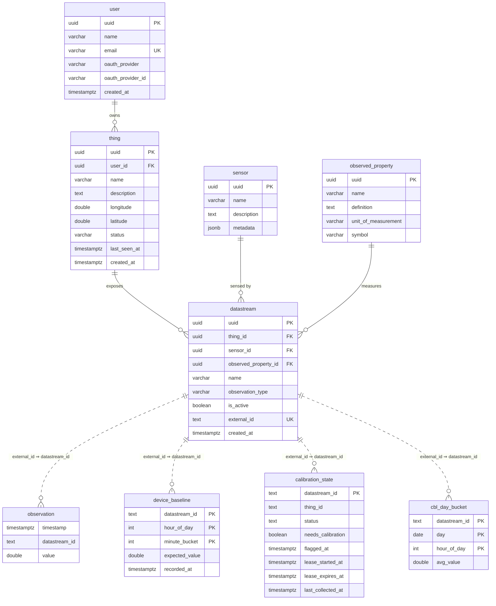

# Database schema (TimescaleDB / `iot`)

This documents every table, continuous aggregate, function, and scheduled job in
`infrastructure/init.sql`, and how they fit together.

## The one big idea: two id "worlds" bridged by `external_id`

The schema has two halves that use **different identifiers**:

- **Registry world (UUIDs).** `user → thing → datastream → {sensor, observed_property}`.
  Everything here is linked by real UUID foreign keys. This is what `core-service` manages.
- **Telemetry world (text id).** `observation`, `device_baseline`, `calibration_state`,
  `cbl_day_bucket`. These are all keyed by the **external id string** the devices actually
  publish, e.g. `power-1`. They are **not** UUID foreign keys (the hot path stays decoupled).

The **bridge** between the two is `datastream.external_id` (= `power-1`). It equals
`observation.datastream_id`, and that single column is what lets `energy_hourly` join telemetry
back to the registry. (This was the recently-fixed join: it used to compare `datastream.uuid`,
which never matched the `power-1` strings.)

## Entity-relationship diagram



Solid lines = enforced UUID foreign keys. Dashed lines = **logical** links on the `external_id`
string (not enforced by a DB constraint, because `observation` is a high-throughput hypertable).

## Tables

### Registry (managed by core-service)

| Table | Key | Purpose |
|---|---|---|
| `user` | `uuid` | Account; `email` is unique. |
| `thing` | `uuid` | A device, owned by a `user`. Has location + `status`/`last_seen_at`. |
| `sensor` | `uuid` | Sensing element; `metadata` JSONB also carries `type` + `external_id`. |
| `observed_property` | `uuid` | What is measured (name, unit, symbol). |
| `datastream` | `uuid` | Ties a `thing` + `sensor` + `observed_property` together. **`external_id`** (e.g. `power-1`, UNIQUE) is the bridge to telemetry. |

### Telemetry & calibration (keyed by `external_id`)

| Table | Key | Purpose |
|---|---|---|
| `observation` | hypertable on `timestamp` | Raw/compressed readings. `datastream_id` holds the `external_id` string. Compressed after 7 days, dropped after 30. |
| `device_baseline` | `(datastream_id, hour_of_day, minute_bucket)` | The expected value per time-of-day. `minute_bucket` is always `0` (hourly). Written by `cbl_rebuild_baseline`. |
| `cbl_day_bucket` | `(datastream_id, day, hour_of_day)` | One pre-aggregated value per hour of each **collected full ("raw") day**. The pool the CBL average reads from. |
| `calibration_state` | `datastream_id` | Orchestrator work list: `status` (`idle`/`collecting`), `needs_calibration` flag, the active collection lease, and `last_collected_at` (cooldown). |

## Continuous aggregates (rollups of `observation`)

A chain, each built from the previous, refreshed by Timescale background policies:

```
observation ──▶ energy_hourly ──▶ energy_daily ──▶ energy_weekly ──▶ energy_monthly
```

- **`energy_hourly`** — `SUM/MIN/MAX/COUNT(value)` per `(hour, datastream_id)`, enriched with
  `thing_id` and `observed_property` by joining `datastream` (on `external_id`) and
  `observed_property`. Average = `total_value / sample_count`. **This is also the input to drift
  detection.**
- **`energy_daily` / `energy_weekly` / `energy_monthly`** — coarser rollups for dashboards.

## Functions

| Function | Used by | What it does |
|---|---|---|
| `energy_tiered(from_ts, to_ts)` | dashboards / queries | Stitches hourly + daily rollups into one tiered result over a range. |
| `cbl_ingest_day(datastream, from, to)` | orchestrator (on lease end) | Aggregates one finished collection window's `observation` rows into `cbl_day_bucket` (one row per hour-of-day). |
| `cbl_rebuild_baseline(datastream, x_days)` | orchestrator (on lease end) | Rebuilds `device_baseline` = average of the **last X full days** per hour (the "DX / last-X-days" CBL). |

## Scheduled jobs

| Job | Engine | Schedule | Reads → Writes | Why |
|---|---|---|---|---|
| Compression | Timescale policy | chunks older than **7 days** | `observation` | Shrink old telemetry. |
| Retention | Timescale policy | data older than **30 days** | `observation` | Drop very old telemetry. |
| `energy_hourly` refresh | CAGG policy | every **30 min** | `observation` → `energy_hourly` | Keep hourly rollup fresh. |
| `energy_daily` refresh | CAGG policy | every **1 h** | `energy_hourly` → `energy_daily` | Daily rollup. |
| `energy_weekly` refresh | CAGG policy | every **6 h** | `energy_daily` → `energy_weekly` | Weekly rollup. |
| `energy_monthly` refresh | CAGG policy | every **1 day** | `energy_weekly` → `energy_monthly` | Monthly rollup. |
| **`flag-needs-calibration`** | **pg_cron** | **hourly (`0 * * * *`)** | `energy_hourly`, `device_baseline` → `calibration_state` | Flag datastreams that need a fresh baseline (see below). |

> Removed in this change: the old per-observation `delta-batch` (every 5 min) and
> `baseline-drift-check` (hourly) crons, plus the `baseline_delta_log` table. Drift is now
> derived from `energy_hourly` instead of a per-reading delta table.

### What `flag-needs-calibration` does (hourly)

One set-based pass over the **whole fleet**:

1. **Register** — insert a `calibration_state` row for any `datastream_id` seen in `energy_hourly`.
2. **Drift** — for each datastream, compare the last 3 days of hourly averages
   (`total_value / sample_count`) to `device_baseline` for the matching hour-of-day; if the mean
   absolute gap `> 0.3` over `> 24` hours (and outside the 1-day cooldown), set `needs_calibration`.
3. **Cold start** — set `needs_calibration` for any datastream that has no `device_baseline` yet.

It only **flags**. It never streams data.

## How calibration actually runs (the lifecycle)

The DB flags; the **traffic-control** service (the orchestrator, outside the DB) acts on the flags,
bounded so at most **N** datastreams collect at once:

```
 flag-needs-calibration (hourly, DB)
        │  sets calibration_state.needs_calibration = TRUE
        ▼
 traffic-control tick (frequent)
        │  picks ≤ N idle+flagged datastreams
        │  status='collecting', sets lease, publishes MQTT "go raw for TTL"
        ▼
 device streams a FULL day → lands in observation
        ▼
 lease expires → traffic-control calls:
        cbl_ingest_day(ds, lease_start, lease_end)   -- observation window → cbl_day_bucket
        cbl_rebuild_baseline(ds, X)                  -- last X full days → device_baseline
        status='idle', last_collected_at=now, needs_calibration=FALSE
        ▼
 device_baseline is fresh → drift clears on the next hourly check
```

> The traffic-control orchestrator (the reconcile tick + the edge `{mode:raw}` command) is not yet
> implemented; the DB side (tables, functions, `flag-needs-calibration`) is.
